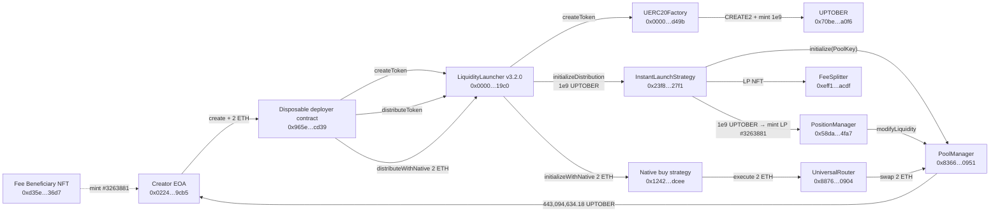

# Uniswap Instant Launch Flow — Uptober (UPTOBER), Robinhood Chain

> This is a read-only analysis. Every address, tx hash and figure comes from Etherscan API V2 (chainid 4663) responses received during this run. 29 calls were used.
> The **Evidence** column of the call-order table separates **observed** (appears directly in the API data) from **inferred** (judged by combining events, calldata and verified source).

## Overview

| Item | Value |
|---|---|
| Chain | Robinhood Chain (chainid 4663) |
| Launch tx | [`0x4fcd0f70f06bdce192f844958726b54acb7d62611cebeacd9c20ed70886fe3d1`](https://robin.etherscan.io/tx/0x4fcd0f70f06bdce192f844958726b54acb7d62611cebeacd9c20ed70886fe3d1) |
| Block / time | 72222806 (tx index 3) / 2026-09-25 12:21:50 UTC |
| Token | Uptober (UPTOBER) — [`0x70be15b7f21e78e5c62fab6becc8ea089183a0f6`](https://robin.etherscan.io/token/0x70be15b7f21e78e5c62fab6becc8ea089183a0f6) · UERC20, decimals 18, total supply 1,000,000,000 |
| Creator (tx sender EOA) | [`0x0224e37d9fbd646b1462fa52dff6ffa761ae9cb5`](https://robin.etherscan.io/address/0x0224e37d9fbd646b1462fa52dff6ffa761ae9cb5) |
| Launch deployer contract (disposable) | [`0x965ef99c303be75ee3e1dad28aef47af93b3cd39`](https://robin.etherscan.io/address/0x965ef99c303be75ee3e1dad28aef47af93b3cd39) — created by this tx, then selfdestructed |
| Strategy | InstantLaunchStrategy [`0x23f8209572b4a1c2ad88a42749e830791fb027f1`](https://robin.etherscan.io/address/0x23f8209572b4a1c2ad88a42749e830791fb027f1) |
| Launcher | LiquidityLauncher v3.2.0 [`0x0000ffffbe8efe702c8703ae3477ff5de3d319c0`](https://robin.etherscan.io/address/0x0000ffffbe8efe702c8703ae3477ff5de3d319c0) |
| tx value / gasUsed | 2 ETH / 2,538,114 |
| Why selected | Among recent TokenLaunched events from the `0x23f8…` strategy, the first launch that is more than 20,000 blocks old and whose pool has Swap logs. Swaps filled the query limit of 1000, so the real number is higher |

### Key Points

- The creator **did not call LiquidityLauncher directly.** The creator EOA deployed the disposable contract `0x965ef99c…` with a contract-creation tx (`to = null`), and its **constructor** called LiquidityLauncher three times and then selfdestructed.
- So the token's `graffiti()` encodes the disposable contract's address, not the creator's. `getGraffiti(msg.sender) = keccak256(abi.encode(msg.sender))`, confirmed from the LiquidityLauncher verified source.
- **Within one tx**, token creation, single-sided liquidity provision of the entire supply, and the creator's 2 ETH initial buy all happened.

## Call Order

| Step | Caller | Target contract | Function / action | Target address | Evidence |
|---|---|---|---|---|---|
| 1 | Creator EOA `0x0224e37d…` | (new) disposable deployer contract | contract creation + constructor, value 2 ETH | `0x965ef99c303be75ee3e1dad28aef47af93b3cd39` | Observed: tx `to=null`, receipt `contractAddress` |
| 2 | `0x965ef99c…` | LiquidityLauncher v3.2.0 | `createToken(factory, "Uptober", "UPTOBER", 18, 1e27, recipient=LiquidityLauncher, tokenData)` | `0x0000ffffbe8efe702c8703ae3477ff5de3d319c0` | Inferred: init code contains calldata with selector `0xdec14be1` + LL `TokenCreated` (log 4) |
| 3 | LiquidityLauncher | UERC20Factory | `createToken(name, symbol, decimals, initialSupply, recipient, tokenData, graffiti)` | `0x000000e200088d55c39a11f609e5f667729ad49b` | Observed: Factory `TokenCreated` (log 3). Function signature per the LL verified source |
| 4 | UERC20Factory | UERC20 token (new) | CREATE2 deployment → mint 1,000,000,000 UPTOBER to LiquidityLauncher | `0x70be15b7f21e78e5c62fab6becc8ea089183a0f6` | Observed: internal `create2` row, Transfer 0x0→LL (log 2) |
| 5 | `0x965ef99c…` | LiquidityLauncher | `distributeToken(token, {strategy: 0x23f8…, amount: 1e27, configData: abi.encode(creator)}, salt=0)` | `0x0000ffffbe8efe702c8703ae3477ff5de3d319c0` | Inferred: selector `0xb6982b48` calldata + `TokenDistributed` (log 18) |
| 6 | LiquidityLauncher | UPTOBER token | `forceApprove(strategy, 1e27)` | `0x70be15b7…` | Observed: Approval LL→strategy (log 5) |
| 7 | LiquidityLauncher | InstantLaunchStrategy | `initializeDistribution(token, 1e27, configData, keccak256(abi.encode(0x965ef99c…, salt)))` | `0x23f8209572b4a1c2ad88a42749e830791fb027f1` | Observed: the strategy's `DistributionInitialized` (log 14). Arguments per the LL source |
| 8 | InstantLaunchStrategy | UPTOBER token | `transferFrom(LL → strategy, 1e27)` | `0x70be15b7…` | Observed: Transfer (log 6) |
| 9 | InstantLaunchStrategy | PoolManager | `initialize(PoolKey, sqrtPriceX96=1582215647010010450556252328775749)` → tick 198050 | `0x8366a39cc670b4001a1121b8f6a443a643e40951` | Observed: `Initialize` (log 7). Whether it was a direct call or via PositionManager is unconfirmed |
| 10 | InstantLaunchStrategy | PositionManager (Uniswap v4 Positions NFT) | transfer 1e27 tokens → mint position, presumed function `modifyLiquidities` | `0x58daec3116aae6d93017baaea7749052e8a04fa7` | Observed: Transfer strategy→PosM (log 8), LP NFT #3263881 mint→strategy (log 9) |
| 11 | PositionManager | PoolManager | `modifyLiquidity` (ticks −160100 ~ 198050, liquidityΔ 50074188046840591947412) + settle 1e27 UPTOBER | `0x8366a39c…` | Observed: `ModifyLiquidity` (log 10), Transfer PosM→PM (log 11) |
| 12 | PoolManager → InstantLaunchStrategy → `0x…dead` | — | Remaining dust of 0.000000000000017786 UPTOBER returned and sent to the burn address | `0x000000000000000000000000000000000000dead` | Observed: log 12, 13 |
| 13 | InstantLaunchStrategy | — | emit `TokenLaunched(poolId, token, feeSplitter, PoolKey)` | `0x23f82095…` | Observed: log 15 |
| 14 | (within the strategy flow) | Fee Beneficiary NFT | mint tokenId 3263881 to the creator (same id as the LP position) | `0xd35e9ca72f64c7f93be30fad67524323396b36d7` | Observed: Transfer 0x0→creator (log 16). Who called it is unconfirmed because the source is unverified |
| 15 | InstantLaunchStrategy | PositionManager → FeeSplitter | transfer LP NFT #3263881 (`safeTransferFrom` → FeeSplitter `onERC721Received`) | `0xeff166aaf189323c58dc27ed1206eb2c37faacdf` | Observed: Transfer strategy→FeeSplitter (log 17). The FeeSplitter source accepts only from PositionManager |
| 16 | `0x965ef99c…` | LiquidityLauncher | `distributeWithNative{value: 2 ETH}(strategy=0x1242…, configData, salt=0, 2e18)` | `0x0000ffffbe8efe702c8703ae3477ff5de3d319c0` | Observed: internal 2 ETH, `TokenDistributed(0x0, 0x1242…, 2e18)` (log 22). Selector `0x0ef847b6` |
| 17 | LiquidityLauncher | Native buy strategy (unverified) | `initializeWithNative{value: 2 ETH}(configData, salt')` | `0x1242c9439d589cae85e121b1f79f2af51e91dcee` | Observed: internal 2 ETH, `DistributionInitialized` (log 21) |
| 18 | `0x1242c943…` | UniversalRouter | presumed `execute{value: 2 ETH}` — commands `0x10 0x04` (V4_SWAP, SWEEP), actions `0x06 0x0b 0x0e` (SWAP_EXACT_IN_SINGLE, SETTLE, TAKE), recipient = creator | `0x8876789976decbfcbbbe364623c63652db8c0904` | Observed: internal 2 ETH, configData. Command decoding inferred from UR standard constants |
| 19 | UniversalRouter | PoolManager | swap: 2 ETH in → 443,094,634.183417276686474675 UPTOBER out → creator | `0x8366a39c…` | Observed: internal 2 ETH, `Swap` (log 19), Transfer PM→creator (log 20) |
| 20 | `0x965ef99c…` | Creator | selfdestruct (value 0) | `0x0224e37d…` | Observed: internal `self-destruct` row |

> **On ordering:** the order of creator → disposable contract → three LiquidityLauncher calls matches both the calldata positions in the init code (`createToken` → `distributeToken` → `distributeWithNative`) and the log index order. The Etherscan API does not provide call traces, so zero-value internal calls (the function names in steps 2, 3, 5, 7 and 9–11) were inferred from events and verified source.

## Diagram (Call Flow)

## PoolKey (TokenLaunched log 15 = PoolManager Initialize log 7)

| Field | Value |
|---|---|
| poolId | `0x7cdbb6d6e904920c7f1669dc530c7b1ab73137dab96eb1eebddc2836dc7b58c9` |
| currency0 | `0x0000000000000000000000000000000000000000` (native ETH) |
| currency1 | `0x70be15b7f21e78e5c62fab6becc8ea089183a0f6` (UPTOBER) |
| fee | 2500 (0.25%) |
| tickSpacing | 25 |
| hooks | `0x0000000000000000000000000000000000000000` (no hook) |
| Initial sqrtPriceX96 / tick | 1582215647010010450556252328775749 / 198050 |
| LP range | tickLower −160100 ~ tickUpper 198050. Single-sided liquidity with tokens only |
| TokenLaunched indexed | topic1 = poolId, topic2 = token, topic3 = `0xeff166aaf189323c58dc27ed1206eb2c37faacdf` (FeeSplitter) |

## graffiti()

| Item | Value |
|---|---|
| `graffiti()` (eth_call, selector `0xf56a499f`) | `0x4b0905bcad82f48bc7fe64878d665975872d6665d3f1ece7779d421bb6dbedfa` |
| Verification | Matches `keccak256(abi.encode(0x965ef99c303be75ee3e1dad28aef47af93b3cd39))` (the disposable contract that called LiquidityLauncher) |
| Note | Computed from the creator EOA it is `0x8d34819c…`, which **does not match** |

## Fund Movement Summary

| Movement | Amount | Logs |
|---|---|---|
| mint 0x0 → LiquidityLauncher | 1,000,000,000 UPTOBER | 2 |
| LiquidityLauncher → InstantLaunchStrategy | 1,000,000,000 UPTOBER | 6 |
| Strategy → PositionManager → PoolManager (liquidity) | 1,000,000,000 UPTOBER | 8, 11 |
| PoolManager → Strategy → 0x…dead (dust) | 0.000000000000017786 UPTOBER | 12, 13 |
| Creator → disposable → LL → native strategy → UniversalRouter → PoolManager | 2 ETH | internal |
| PoolManager → creator (initial buy) | 443,094,634.183417276686474675 UPTOBER | 20 |

## Not Confirmed

- **Full call tree:** the Etherscan API has no debug trace, so the function names of zero-value internal calls were inferred from events and verified source.
- **Unverified contracts:** the sources of InstantLaunchStrategy, the native buy strategy `0x1242…`, PositionManager `0x58da…` and Fee Beneficiary `0xd35e…` are not published. So it cannot be determined who called PoolManager.initialize or who minted the Fee Beneficiary NFT.
- **Nametag:** `nametag/getaddresstag` returned `Error! Missing Or invalid Action name`. Labels come from the verified ContractName, `name()` call results, and the fixed information given in the request.
- **Scope:** only the single launch tx is covered. Subsequent swaps and fee collection were not traced.

## Files

- Case JSON: `cases/case-4fcd0f70-flow.json` (the original is in the session scratchpad). Import it into the Etherscan Flow canvas. It has 14 nodes and 17 edges and passed schema and invariant validation.
