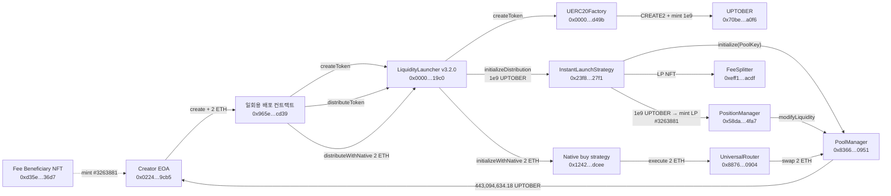

# Uniswap Instant Launch 런칭 흐름 — Uptober (UPTOBER), Robinhood Chain

> 읽기 전용 분석입니다. 모든 주소, tx hash, 수치는 이번 실행에서 받은 Etherscan API V2(chainid 4663) 응답에서 가져왔어요. 사용한 호출은 29회입니다.
> 호출 순서 표의 **근거** 열은 **관측**(API 데이터에 직접 나옴)과 **추론**(이벤트, calldata, 검증된 소스를 조합해 판단)을 나눠 적었어요.

## 개요

| 항목 | 값 |
|---|---|
| 체인 | Robinhood Chain (chainid 4663) |
| 런칭 tx | [`0x4fcd0f70f06bdce192f844958726b54acb7d62611cebeacd9c20ed70886fe3d1`](https://robin.etherscan.io/tx/0x4fcd0f70f06bdce192f844958726b54acb7d62611cebeacd9c20ed70886fe3d1) |
| 블록 / 시각 | 72222806 (tx index 3) / 2026-09-25 12:21:50 UTC |
| 토큰 | Uptober (UPTOBER) — [`0x70be15b7f21e78e5c62fab6becc8ea089183a0f6`](https://robin.etherscan.io/token/0x70be15b7f21e78e5c62fab6becc8ea089183a0f6) · UERC20, decimals 18, 총발행 1,000,000,000 |
| 크리에이터 (tx 발신 EOA) | [`0x0224e37d9fbd646b1462fa52dff6ffa761ae9cb5`](https://robin.etherscan.io/address/0x0224e37d9fbd646b1462fa52dff6ffa761ae9cb5) |
| 런칭 배포 컨트랙트 (일회용) | [`0x965ef99c303be75ee3e1dad28aef47af93b3cd39`](https://robin.etherscan.io/address/0x965ef99c303be75ee3e1dad28aef47af93b3cd39) — 이 tx로 생성된 뒤 selfdestruct |
| 전략 | InstantLaunchStrategy [`0x23f8209572b4a1c2ad88a42749e830791fb027f1`](https://robin.etherscan.io/address/0x23f8209572b4a1c2ad88a42749e830791fb027f1) |
| 런처 | LiquidityLauncher v3.2.0 [`0x0000ffffbe8efe702c8703ae3477ff5de3d319c0`](https://robin.etherscan.io/address/0x0000ffffbe8efe702c8703ae3477ff5de3d319c0) |
| tx value / gasUsed | 2 ETH / 2,538,114 |
| 선택 이유 | `0x23f8…` 전략의 최근 TokenLaunched 중, 2만 블록 이상 지났고 풀에 Swap 로그가 있는 첫 번째 런칭. 조회 한도인 1000건까지 Swap이 찍혀서 실제로는 그 이상 |

### 핵심 포인트

- 크리에이터가 LiquidityLauncher를 **직접 부르지 않았어요.** 크리에이터 EOA가 contract-creation tx(`to = null`)로 일회용 컨트랙트 `0x965ef99c…`를 배포했고, 그 **생성자**가 LiquidityLauncher를 세 번 호출한 뒤 selfdestruct했어요.
- 그래서 토큰의 `graffiti()`에는 크리에이터가 아니라 일회용 컨트랙트 주소가 인코딩돼 있어요. `getGraffiti(msg.sender) = keccak256(abi.encode(msg.sender))`이고, LiquidityLauncher 검증 소스로 확인했어요.
- **한 tx 안에서** 토큰 생성, 전체 공급량 단면(single-sided) 유동성 공급, 크리에이터의 2 ETH 초기 매수가 모두 일어났어요.

## 호출 순서

| 단계 | 호출자 | 대상 컨트랙트 | 함수 / 동작 | 대상 주소 | 근거 |
|---|---|---|---|---|---|
| 1 | 크리에이터 EOA `0x0224e37d…` | (신규) 일회용 배포 컨트랙트 | contract creation + constructor, value 2 ETH | `0x965ef99c303be75ee3e1dad28aef47af93b3cd39` | 관측: tx `to=null`, receipt `contractAddress` |
| 2 | `0x965ef99c…` | LiquidityLauncher v3.2.0 | `createToken(factory, "Uptober", "UPTOBER", 18, 1e27, recipient=LiquidityLauncher, tokenData)` | `0x0000ffffbe8efe702c8703ae3477ff5de3d319c0` | 추론: init code에 선택자 `0xdec14be1` calldata 포함 + LL `TokenCreated` (log 4) |
| 3 | LiquidityLauncher | UERC20Factory | `createToken(name, symbol, decimals, initialSupply, recipient, tokenData, graffiti)` | `0x000000e200088d55c39a11f609e5f667729ad49b` | 관측: Factory `TokenCreated` (log 3). 함수 시그니처는 LL 검증 소스 기준 |
| 4 | UERC20Factory | UERC20 토큰 (신규) | CREATE2 배포 → 1,000,000,000 UPTOBER를 LiquidityLauncher에 mint | `0x70be15b7f21e78e5c62fab6becc8ea089183a0f6` | 관측: internal `create2` 행, Transfer 0x0→LL (log 2) |
| 5 | `0x965ef99c…` | LiquidityLauncher | `distributeToken(token, {strategy: 0x23f8…, amount: 1e27, configData: abi.encode(creator)}, salt=0)` | `0x0000ffffbe8efe702c8703ae3477ff5de3d319c0` | 추론: 선택자 `0xb6982b48` calldata + `TokenDistributed` (log 18) |
| 6 | LiquidityLauncher | UPTOBER 토큰 | `forceApprove(strategy, 1e27)` | `0x70be15b7…` | 관측: Approval LL→strategy (log 5) |
| 7 | LiquidityLauncher | InstantLaunchStrategy | `initializeDistribution(token, 1e27, configData, keccak256(abi.encode(0x965ef99c…, salt)))` | `0x23f8209572b4a1c2ad88a42749e830791fb027f1` | 관측: 전략의 `DistributionInitialized` (log 14). 인자는 LL 소스 기준 |
| 8 | InstantLaunchStrategy | UPTOBER 토큰 | `transferFrom(LL → strategy, 1e27)` | `0x70be15b7…` | 관측: Transfer (log 6) |
| 9 | InstantLaunchStrategy | PoolManager | `initialize(PoolKey, sqrtPriceX96=1582215647010010450556252328775749)` → tick 198050 | `0x8366a39cc670b4001a1121b8f6a443a643e40951` | 관측: `Initialize` (log 7). 직접 호출인지 PositionManager 경유인지는 미확인 |
| 10 | InstantLaunchStrategy | PositionManager (Uniswap v4 Positions NFT) | 토큰 1e27 전송 → 포지션 mint, 추정 함수 `modifyLiquidities` | `0x58daec3116aae6d93017baaea7749052e8a04fa7` | 관측: Transfer strategy→PosM (log 8), LP NFT #3263881 mint→strategy (log 9) |
| 11 | PositionManager | PoolManager | `modifyLiquidity` (ticks −160100 ~ 198050, liquidityΔ 50074188046840591947412) + settle 1e27 UPTOBER | `0x8366a39c…` | 관측: `ModifyLiquidity` (log 10), Transfer PosM→PM (log 11) |
| 12 | PoolManager → InstantLaunchStrategy → `0x…dead` | — | 잔여 dust 0.000000000000017786 UPTOBER를 돌려받아 소각 주소로 전송 | `0x000000000000000000000000000000000000dead` | 관측: log 12, 13 |
| 13 | InstantLaunchStrategy | — | `TokenLaunched(poolId, token, feeSplitter, PoolKey)` emit | `0x23f82095…` | 관측: log 15 |
| 14 | (전략 흐름 안) | Fee Beneficiary NFT | 크리에이터에게 tokenId 3263881 mint (LP 포지션과 같은 id) | `0xd35e9ca72f64c7f93be30fad67524323396b36d7` | 관측: Transfer 0x0→creator (log 16). 누가 호출했는지는 미검증 소스라 미확인 |
| 15 | InstantLaunchStrategy | PositionManager → FeeSplitter | LP NFT #3263881 전송 (`safeTransferFrom` → FeeSplitter `onERC721Received`) | `0xeff166aaf189323c58dc27ed1206eb2c37faacdf` | 관측: Transfer strategy→FeeSplitter (log 17). FeeSplitter 소스는 PositionManager만 수신 허용 |
| 16 | `0x965ef99c…` | LiquidityLauncher | `distributeWithNative{value: 2 ETH}(strategy=0x1242…, configData, salt=0, 2e18)` | `0x0000ffffbe8efe702c8703ae3477ff5de3d319c0` | 관측: internal 2 ETH, `TokenDistributed(0x0, 0x1242…, 2e18)` (log 22). 선택자 `0x0ef847b6` |
| 17 | LiquidityLauncher | 네이티브 매수 전략 (미검증) | `initializeWithNative{value: 2 ETH}(configData, salt')` | `0x1242c9439d589cae85e121b1f79f2af51e91dcee` | 관측: internal 2 ETH, `DistributionInitialized` (log 21) |
| 18 | `0x1242c943…` | UniversalRouter | 추정 `execute{value: 2 ETH}` — commands `0x10 0x04` (V4_SWAP, SWEEP), actions `0x06 0x0b 0x0e` (SWAP_EXACT_IN_SINGLE, SETTLE, TAKE), 수령자 = 크리에이터 | `0x8876789976decbfcbbbe364623c63652db8c0904` | 관측: internal 2 ETH, configData. 명령 해석은 UR 표준 상수 기준 추론 |
| 19 | UniversalRouter | PoolManager | swap: ETH 2 입금 → UPTOBER 443,094,634.183417276686474675 출금 → 크리에이터 | `0x8366a39c…` | 관측: internal 2 ETH, `Swap` (log 19), Transfer PM→creator (log 20) |
| 20 | `0x965ef99c…` | 크리에이터 | selfdestruct (value 0) | `0x0224e37d…` | 관측: internal `self-destruct` 행 |

> **순서에 대해:** 크리에이터 → 일회용 컨트랙트 → LiquidityLauncher 호출 세 번의 순서는 init code 안 calldata 위치(`createToken` → `distributeToken` → `distributeWithNative`)와 로그 인덱스 순서가 일치해요. Etherscan API는 call trace를 주지 않아서, 값이 0인 내부 호출(2, 3, 5, 7, 9–11단계의 함수명)은 이벤트와 검증 소스로 추론한 것입니다.

## 다이어그램 (호출 흐름)

## PoolKey (TokenLaunched log 15 = PoolManager Initialize log 7)

| 필드 | 값 |
|---|---|
| poolId | `0x7cdbb6d6e904920c7f1669dc530c7b1ab73137dab96eb1eebddc2836dc7b58c9` |
| currency0 | `0x0000000000000000000000000000000000000000` (네이티브 ETH) |
| currency1 | `0x70be15b7f21e78e5c62fab6becc8ea089183a0f6` (UPTOBER) |
| fee | 2500 (0.25%) |
| tickSpacing | 25 |
| hooks | `0x0000000000000000000000000000000000000000` (hook 없음) |
| 초기 sqrtPriceX96 / tick | 1582215647010010450556252328775749 / 198050 |
| LP 범위 | tickLower −160100 ~ tickUpper 198050. 토큰만 넣은 단면 유동성 |
| TokenLaunched indexed | topic1 = poolId, topic2 = token, topic3 = `0xeff166aaf189323c58dc27ed1206eb2c37faacdf` (FeeSplitter) |

## graffiti()

| 항목 | 값 |
|---|---|
| `graffiti()` (eth_call, 선택자 `0xf56a499f`) | `0x4b0905bcad82f48bc7fe64878d665975872d6665d3f1ece7779d421bb6dbedfa` |
| 검증 | `keccak256(abi.encode(0x965ef99c303be75ee3e1dad28aef47af93b3cd39))`와 일치 (LiquidityLauncher를 부른 일회용 컨트랙트) |
| 참고 | 크리에이터 EOA로 계산하면 `0x8d34819c…`라 **일치하지 않아요** |

## 자금 이동 요약

| 이동 | 금액 | 로그 |
|---|---|---|
| mint 0x0 → LiquidityLauncher | 1,000,000,000 UPTOBER | 2 |
| LiquidityLauncher → InstantLaunchStrategy | 1,000,000,000 UPTOBER | 6 |
| Strategy → PositionManager → PoolManager (유동성) | 1,000,000,000 UPTOBER | 8, 11 |
| PoolManager → Strategy → 0x…dead (dust) | 0.000000000000017786 UPTOBER | 12, 13 |
| 크리에이터 → 일회용 → LL → 네이티브 전략 → UniversalRouter → PoolManager | 2 ETH | internal |
| PoolManager → 크리에이터 (초기 매수) | 443,094,634.183417276686474675 UPTOBER | 20 |

## 확인하지 못한 것

- **호출 트리 전체:** Etherscan API에는 debug trace가 없어서, 값이 0인 내부 호출의 함수명은 이벤트와 검증 소스로 추론했어요.
- **미검증 컨트랙트:** InstantLaunchStrategy, 네이티브 매수 전략 `0x1242…`, PositionManager `0x58da…`, Fee Beneficiary `0xd35e…`는 소스가 공개돼 있지 않아요. 그래서 PoolManager.initialize를 누가 불렀는지, Fee Beneficiary NFT를 누가 mint했는지는 확정할 수 없어요.
- **Nametag:** `nametag/getaddresstag`가 `Error! Missing Or invalid Action name`을 반환했어요. 라벨은 검증된 ContractName, `name()` 호출 결과, 요청에 주신 고정 정보에서 가져왔어요.
- **범위:** 런칭 tx 한 건만 다뤘어요. 이후 스왑과 수수료 수령은 추적하지 않았어요.

## 파일

- Case JSON: `cases/case-4fcd0f70-flow.json` (원본은 세션 scratchpad에 있음). Etherscan Flow 캔버스에 import하면 됩니다. 노드 14개, 엣지 17개이고 스키마와 불변식 검증을 통과했어요.
